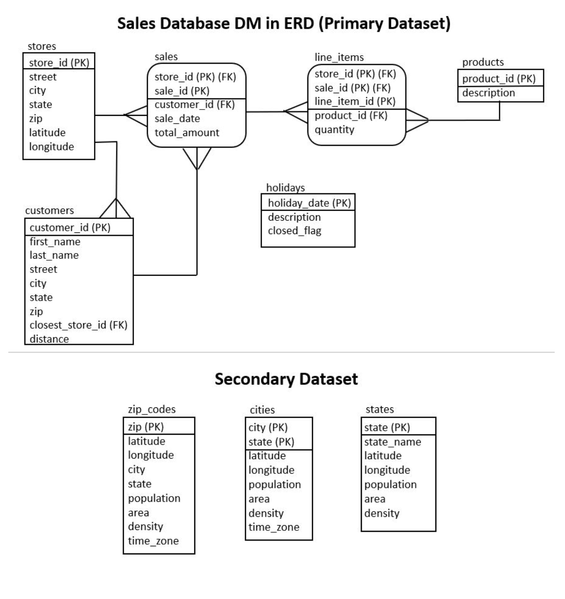

# Route Optimization Project

## Overview

This project was hosted on AWS in a docker cluster running one container for Python and one container for PostgreSQL. In this first phase of this project, we begin by exploring the various tables in the model to answer basic questions about the business to establish a baseline for sales metrics.
The raw data is provided in nested json format and requires using custom code to parse and generate the data tables for the Model.

## Data Model

The Data Model in Entity-Relationship Diagram notation:

## Data Dictionaries

**stores**

- store_id (PK) numeric(6) - unique id number for each store
- street varchar(32) - street part of the address: number, street name, street suffix, etc.
- city varchar(32) - city
- state varchar(2) - 2 letter US Post Office abbreviation for the state
- zip varchar(5) - 5 didgit zip code assigned by the US Post Office
- latitude numeric(7,4) - latitude in decimal format
- longitude numeric(7,4) - longitude in decimal form

**customers**

- customer_id (PK) numeric(6) - unique compute generated id for each customer
- first_name varchar(32) - customer's first name (fictitious)
- last_name varchar(32) - customer's last name (fictitious)
- street varchar(32) - street part of the address: number, street name, street suffix, etc. (fictitious)
- city varchar(32) - city
- state varchar(2) - 2 letter US Post Office abbreviation for the state
- zip varchar(5) - 5 didgit zip code assigned by the US Post Office
- closest_store_id (FK) numeric(6) - closest store to the customer and generally the main store the customer would shop at
-  distance numeric(3) - distance in miles of the customer's zip code center to the store 

**products**

- product_id (PK) numeric(3) - unique id number for each product
- description varchar(32) - description of the product

**holidays**

- holiday_date (PK) date - date of the holiday
- description varchar(32) - description of the holiday
- closed_flag boolean - True if stores are closed, False if open

**sales**

- store_id (PK) (FK) numeric(6) - store that made this sale
- sale_id (PK) numeric(8) - computer generated id for this sale, unique only within a store
- customer_id (FK) numeric(6) - customer who bought this sale
- sale_date date - date of the sale
- total_amount numeric(5) - total dollar amount of the sale

**line_items**

- store_id (PK) (FK) numeric(6) - store that made this sale
- sale_id (PK) (FK) numeric(8) - computer generated id for this sale, unique only within a store
- line_item_id (PK) numeric(3) - computer generated line item id for this sale, unique only within a store and a sale
- product_id (FK) numeric(3) - product that was purchased
- quantity numeric(3) - quantity of the product that was purchased

**zip_codes**

- zip (PK) varchar(5) - official US Postal Service zip code
- latitude numeric(7,4) - latitude in decimal format
- longitude numeric(7,4) - longitude in decimal format
- city varchar(32) - city
- state varchar(2) - 2 letter US Post Office abbreviation for the statenearest zip code with population
- population numeric(7) - number of people who live in that zip code
- area numeric(9,4) - area in square miles
- density numeric(10,2) - population density in terms of number of people per square mile for the zip code
- time_zone varchar(32) - time zone in official ICANN "tz database" format

**cities**

- city (PK) varchar(32) - city
- state (PK) varchar(2) - 2 letter US Post Office abbreviation for the state
- latitude numeric(7,4) - latitude in decimal format
- longitude numeric(7,4) - longitude in decimal format
- population numeric(9) - number of people who live in that city
- area numeric(10,4) - area in square miles
- density numeric(10,2) - population density in terms of number of people per square mile for the city
- time_zone varchar(32) - time zone in official ICANN "tz database" format

**states**

- state (PK) varchar(2) - 2 letter US Post Office abbreviation for the state
- state_name varchar(32) - official name of the state
- latitude numeric(7,4) - latitude in decimal format
- longitude numeric(7,4) - longitude in decimal format
- population numeric(10) - number of people who live in that state
- area numeric(10,4) - area in square miles for the state
- density numeric(10,2) - population density in terms of number of people per square mile for the state